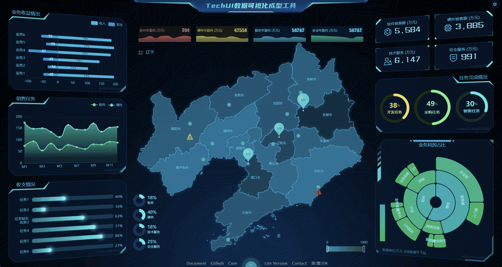
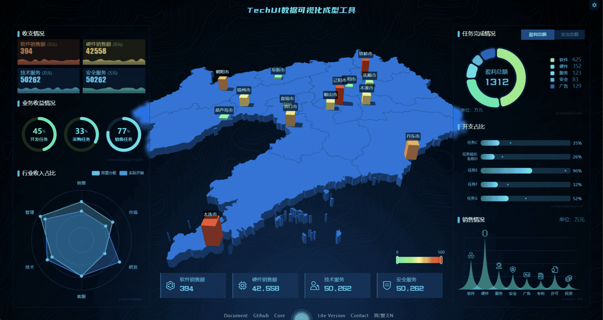
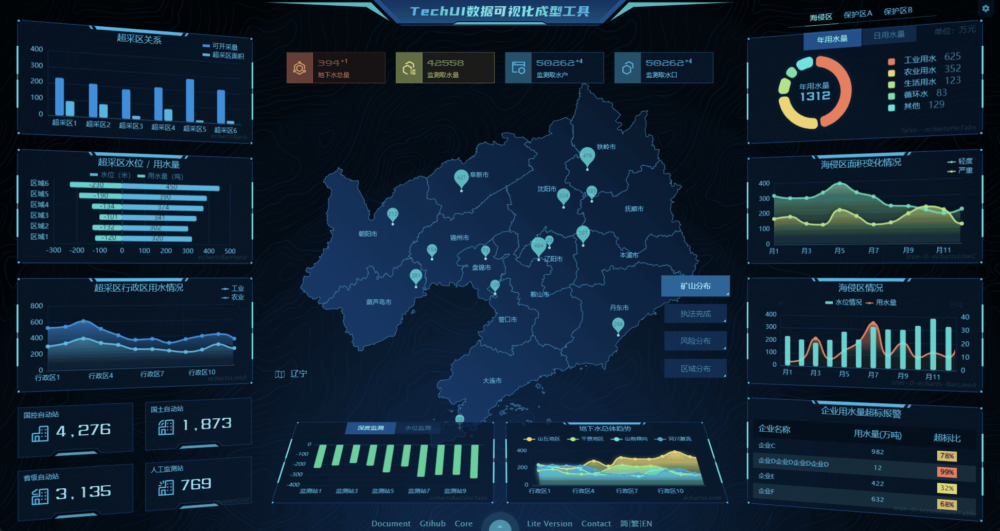
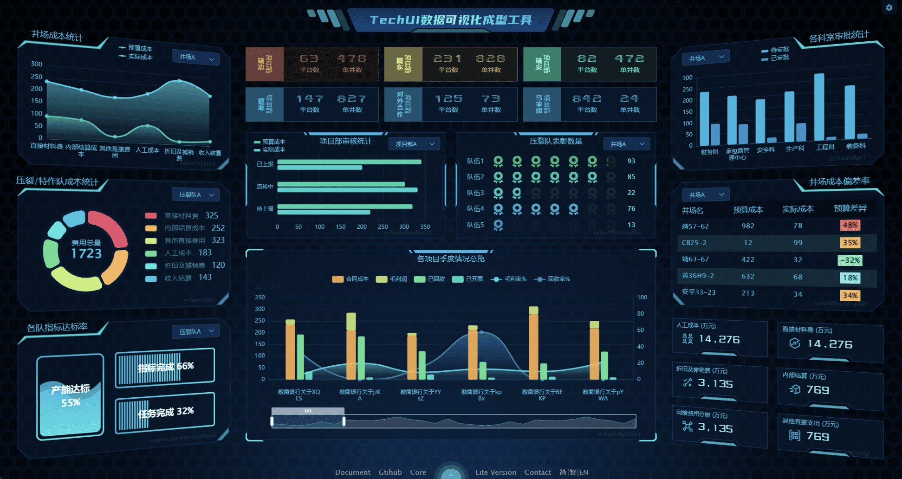
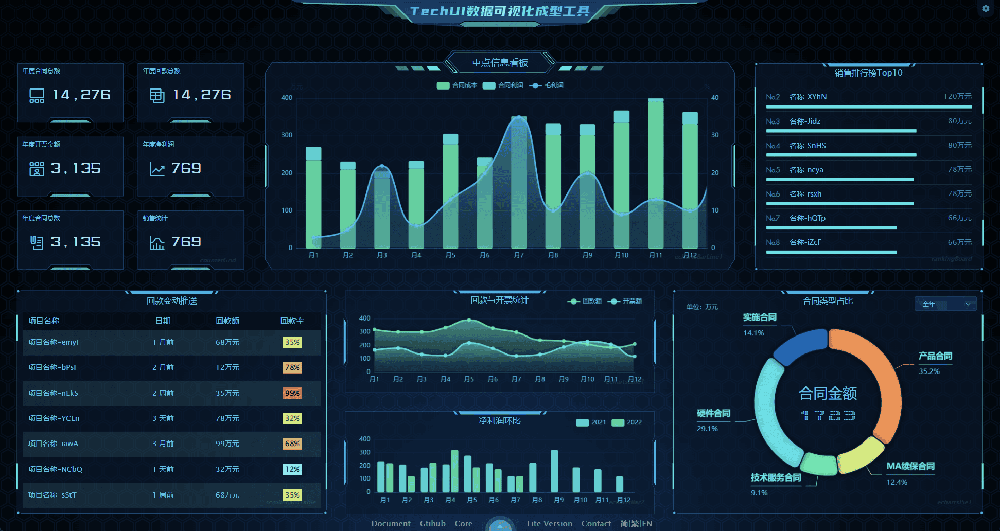
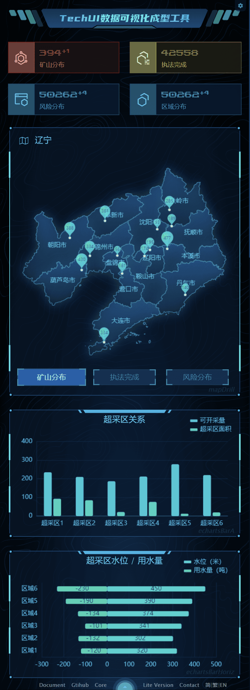
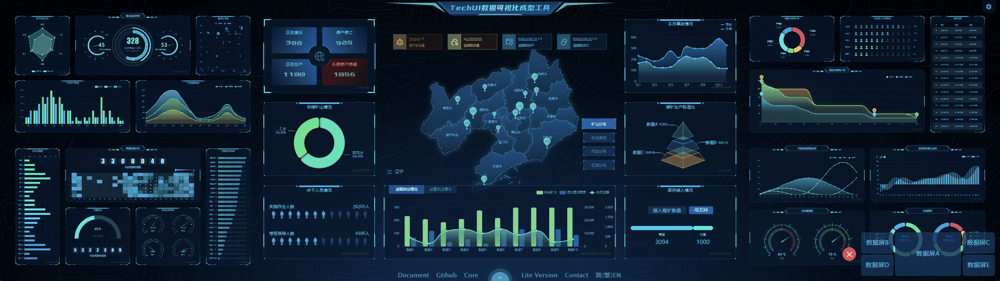
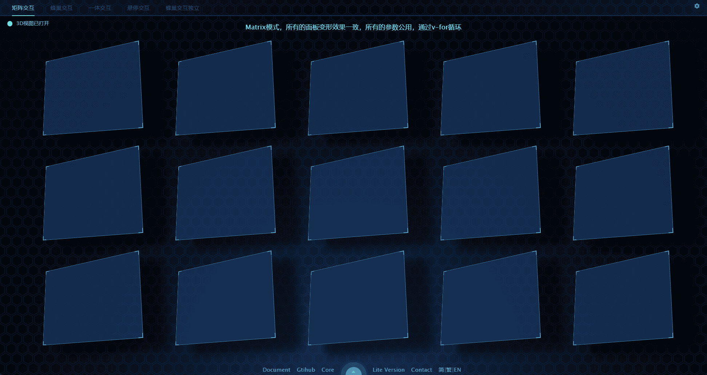
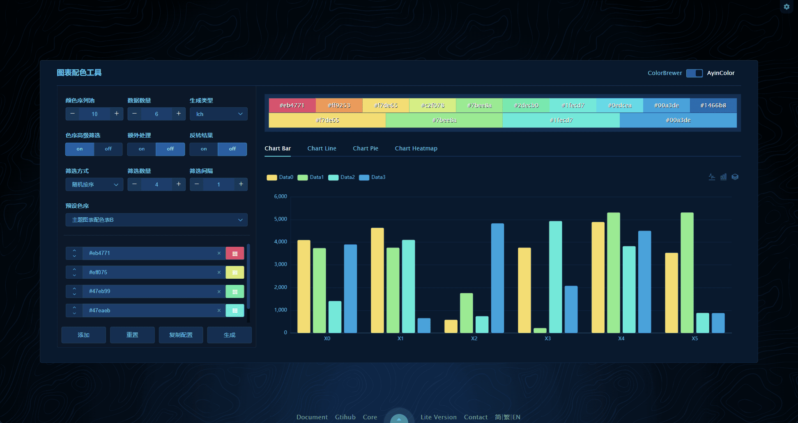
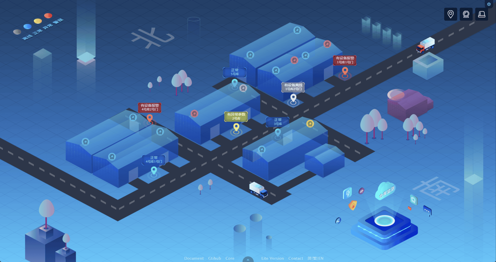

简体中文 | [繁體中文](./README.hk.md) | [English](./README.md)

<h1 align="center">
<b>TechUI 开发包1</b>
</h1>

TechUI是一款简单易用的动态SVG可视化大屏开发框架，基于vite+vue2开发

  <a href="https://techui.net/docs">文档</a> •
  <a href="https://techui.net/">演示站</a> •
  <a href="https://www.npmjs.com/package/techui-vue2">核心库</a> •
  <a href="https://lite.techui.net/docs">免费版</a> •
  <a href="https://t.me/ayin86cn">Telgram</a>

## 🛡️声明

**本开发包内置的临时许可证，仅用于测试、体验、学习。无法调试，无法打包部署。** 

**另外提供了一款免费的[techUI-lite](https://lite.techui.net/docs/)框架,欢迎下载使用**

本开发包内的文件为源码，仅需更新许可证即可用于商业项目开发，详情请联系管理员。
- 高级版的授权用户，联系管理员更新许可证后直接进入开发阶段。
- 请在本文档底部，查询我的联系方式。

-----

目前开发包内置了4个版本
- package-i18n 多语言开发包，内置了3种语言，简中、繁中、English
- package-english 单语言开发包-English
- package-simple-chinese 单语言开发包-简中
- package-traditional-chinese 单语言开发包-繁中

请根据具体需求下载，i18n版本因为调用language定义，所以稍显复杂，尽量选择单语言开发包进行测试和开发。

-----

**本开发包内置数个Dashboard，如下图。**

**DashboardA**

**DashboardB**

**DashboardC**

**DashboardD**

**DashboardE**

**DashboardA-移动端** 

**企业拼接屏4x2**

**3D面板**

**图表配色工具**

**更多demo，请查阅 [techUI Demo](https://techui.net/)** 

-----

## ✨特性

- **🖥️全端适配**

  完美的全端适配方案，个人电脑、手机、平板、企业拼接屏，可以说任何终端设备均可以完美适配，行业内领先的适配方案。

- **🎨强大的内置主题**

  一键切换风格，所有元素，事无巨细的元素和细节均完美支持主题切换。主题可以根据客户需求使用内置主题设计器进行快速的定制化开发。

- **🛸自由开发无限制**

  采用webpack、vue2等流行技术栈，通过调用自研发组件和图表组件，不需要过多繁琐的开发过程即可快速部署上线，大大缩短了开发周期。真正做到了源码级的自由开发。

- **🧩去位图化全面使用SVG**

  全面矢量化（去位图化），因可视化大屏的特殊使用场景，采用传统位图的情况图形放大细节模糊，而采用矢量图细节缩放后还能保持原来的细节清晰度。

- **📊企业拼接屏**

  面对企业级的拼接屏，我们有着非常多的展现方案，可以根据客户的拼接屏设备情况进行定制开发。在任意设备下均可以达到最佳的展现效果。

- **🌈图表智能配色**

  使用本框架，就彻底告别了图表配色这一头疼的问题。提供了智能图表配色的功能和图表配色工具。

- **🗺️GEO 3D 地图**

  基于GEO Json格式的地图，简单易上手，能满足绝大多数的使用场景，可以在地图上放置点、线、面、图形等任意数据。可以用平面或者3D的形式展现地图。

- **🧑‍国际化**

  面向全球业务，扩大市场覆盖范围，国际化可以提高用户满意度、降低开发和维护成本、增加软件的可扩展性。

- **🚀稳步迭代急速响应**

  本框架历经三个大版本，无数小版本的迭代，bug修复及时，功能拓展稳步进行中。对于付费用户可以做到及时响应。

-----

## 📜更新说明

- **20230707 发布框架 techui-vue2、techui-vue3-lite、演示demo、文档、开发包，其中vue2开发包含多语言和单语言版本。**
- **20230701 核心升级至3.1, 从3.0开始采用了wasm模块来做许可证逻辑、加解密逻辑、SVG动态节点计算**
- **202304-202306 核心版本2.0-2.2版本，大范围修改组件名称，调用方式，内置方法，使整个框架更加的规范易用。**
- **20230316 核心升级至1.4 新增了系统标题组件，以及大量细节修改。**
- **20230302 移动端Dashboard，拼接屏的开发源码，集成到开发包中。**
- **20230225 文档更新英文和繁体中文语言**
- **20230223 首次发布开发包到Gitee和Github，文档同步发布**

-----

## 📖安装教程

1.  `cnpm i` 安装依赖，建议使用cnpm
2.  `npm run dev` 启动项目即可预览

开发包介绍和使用方式请查阅 [文档](https://techui.net/docs)

-----

## 🛠️兼容性和Nodejs版本

1. nodejs 16-18 支持良好其他版本未测试
2. 除IE外的主流浏览器均支持良好，包括移动端浏览器。

-----

## 🌟合作洽谈

Lite版本框架免费使用，不提供任何技术支持，遇到问题请在github提交issues，或者添加以下QQ群进行技术交流。

数据可视化TechGroupQQ群:119059920 技术交流

或者添加 [TechUI discord](https://discord.gg/JXgn5Gq2)讨论群组。

或者添加 [TechUI Telgram](https://t.me/+RJZ4cmDrcCFmNWNl)讨论群组。

对于付费服务，如定制开发、技术支持，或购买高级许可证，请通过以下联系方式与我联系

微信：ayin86cn

海外客户，请通过邮件联系  ayin86cn@gmail.com

也可以添加TechUI的Telgram讨论群组 [TechUI](https://t.me/+RJZ4cmDrcCFmNWNl)

-----
## ❤️我能提供的服务

作者本人，由UI设计师转为前端开发，从业15年之久，在一个项目或产品的开发中，可以承担的职责有：产品经理、UI设计师、前端开发。

所以，可以说是初创公司最佳且划算的合作伙伴，欢迎洽谈合作。

#### 可以具体做的工作

- UI设计图
- 产品、项目的规划和设计
- 可视化项目开发
- GEO项目开发（echarts+geojson+在线地图）
- Rust开发WASM模块
- 任意类型的业务系统
- 移动端开发
- 文档编撰
- 前端安全，加解密

