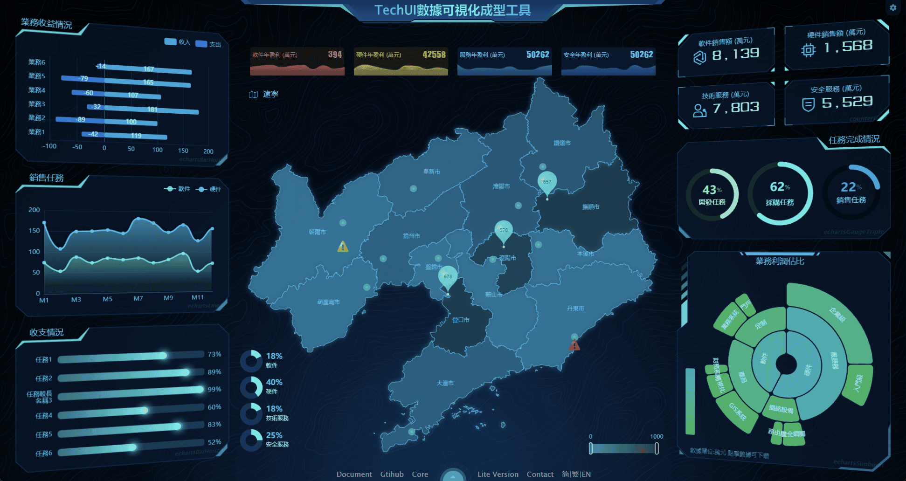
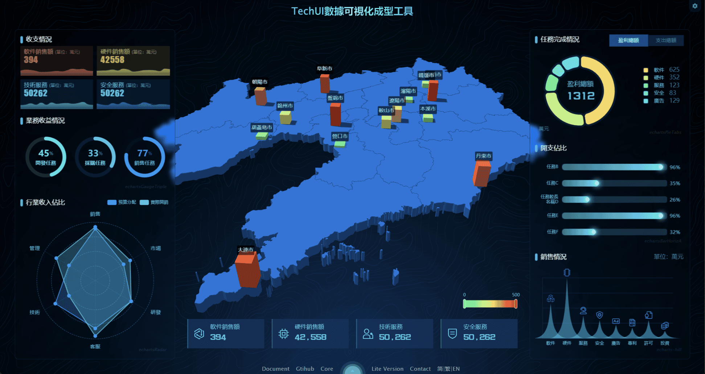
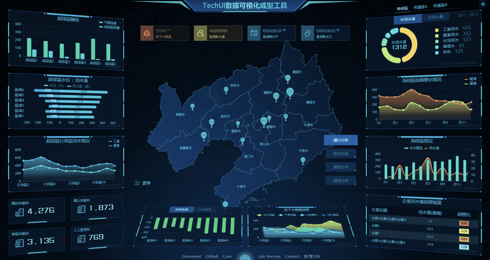
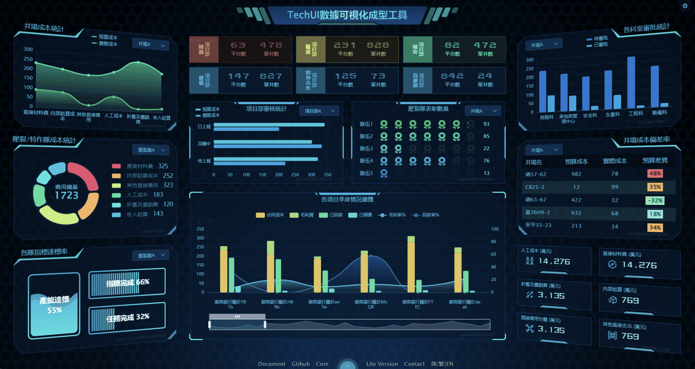
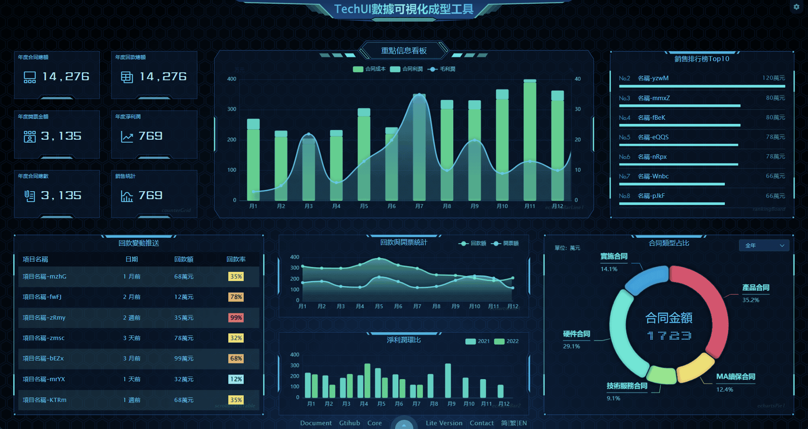
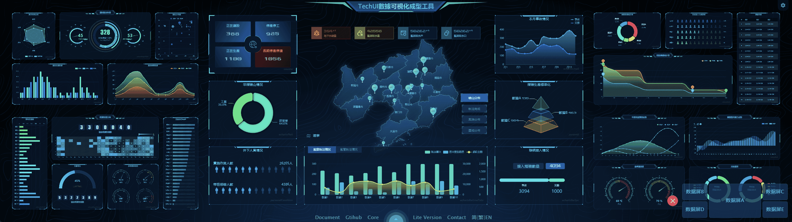
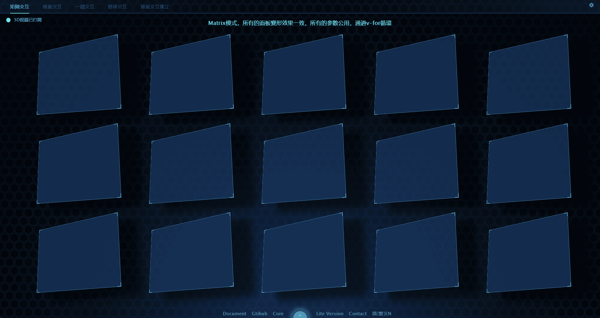
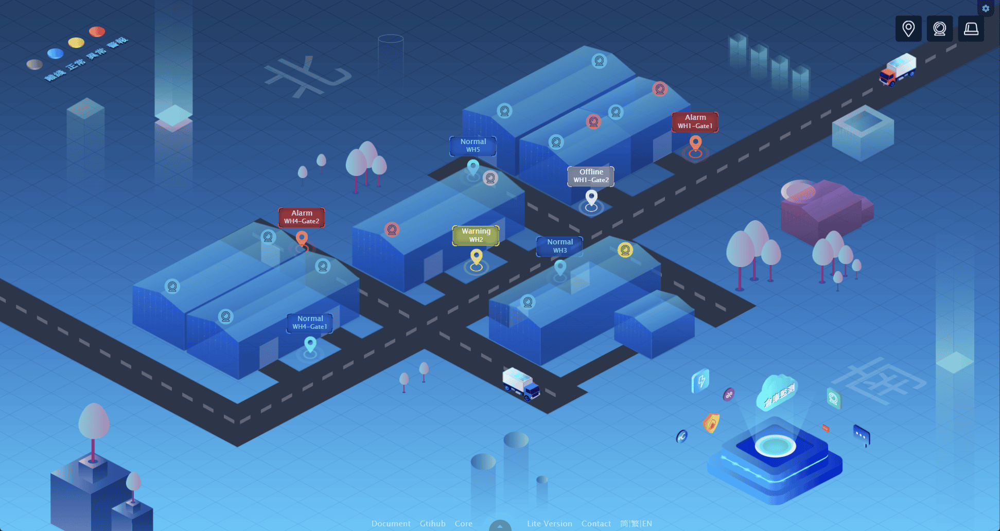
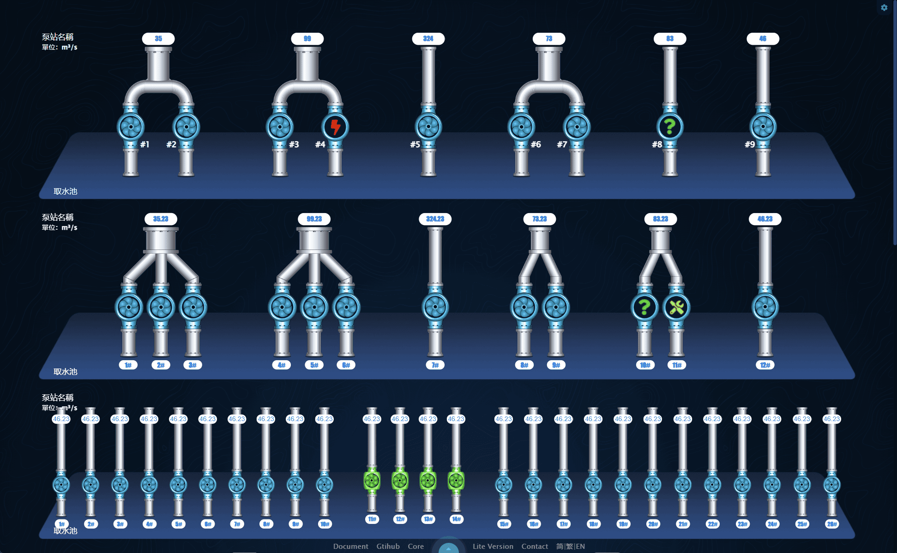

[简体中文](./README.cn.md) | 繁體中文 | [English](./README.md)

<h1 align="center">
<b>TechUI 開發包</b>
</h1>

TechUI是一款簡單易用的動態SVG可視化大屏開發框架，基於vite+vue2開發

  <a href="https://techui.net/docs">文檔</a> •
  <a href="https://techui.net/">演示站</a> •
  <a href="https://www.npmjs.com/package/techui-vue2">核心庫</a> •
  <a href="https://lite.techui.net/docs">免費版</a> •
  <a href="https://t.me/ayin86cn">Telgram</a>

## 🛡️聲明

**本開發包內置的臨時許可證，僅用於測試、體驗、學習。無法調試，無法打包部署。** 

**另外提供了一款免費的[techUI-lite](https://lite.techui.net/docs/)框架,歡迎下載使用**

本開發包內的文件為源碼，僅需更新許可證即可用於商業項目開發，詳情請聯繫管理員。
- 高級版的授權用戶，聯繫管理員更新許可證後直接進入開發階段。
- 請在本文檔底部，查詢我的聯繫方式。

-----

目前開發包內置了4個版本
- package-i18n 多語言開發包，內置了3種語言，簡中、繁中、English
- package-english 單語言開發包-English
- package-simple-chinese 單語言開發包-簡中
- package-traditional-chinese 單語言開發包-繁中

請根據具體需求下載，i18n版本因為調用language定義，所以稍顯複雜，盡量選擇單語言開發包進行測試和開發。

-----

**本開發包內置數個Dashboard，如下圖。**

**DashboardA**

**DashboardB**

**DashboardC**

**DashboardD**

**DashboardE**

**DashboardA-移動端** 

**企業拼接屏4x2**

**3D面板**

**圖表配色工具**

**更多demo，請查閱 [techUI Demo](https://techui.net/)** 

-----

## ✨特性

- **🖥️全端適配**

  完美的全端適配方案，個人電腦、手機、平板、企業拼接屏，可以說任何終端設備均可以完美適配，行業內領先的適配方案。

- **🎨強大的內置主題**

  一鍵切換風格，所有元素，事無鉅細的元素和細節均完美支持主題切換。主題可以根據客戶需求使用內置主題設計器進行快速的定制化開發。

- **🛸自由開發無限制**

  採用webpack、vue2等流行技術棧，通過調用自研發組件和圖表組件，不需要過多繁瑣的開發過程即可快速部署上線，大大縮短了開發週期。真正做到了源碼級的自由開發。

- **🧩去位圖化全面使用SVG**

  全面矢量化（去位圖化），因可視化大屏的特殊使用場景，採用傳統位圖的情況圖形放大細節模糊，而採用矢量圖細節縮放後還能保持原來的細節清晰度。

- **📊企業拼接屏**

  面對企業級的拼接屏，我們有著非常多的展現方案，可以根據客戶的拼接屏設備情況進行定制開發。在任意設備下均可以達到最佳的展現效果。

- **🌈圖表智能配色**

  使用本框架，就徹底告別了圖表配色這一頭疼的問題。提供了智能圖表配色的功能和圖表配色工具。

- **🗺️GEO 3D 地圖**

  基於GEO Json格式的地圖，簡單易上手，能滿足絕大多數的使用場景，可以在地圖上放置點、線、面、圖形等任意數據。可以用平面或者3D的形式展現地圖。

- **🧑‍國際化**

  面向全球業務，擴大市場覆蓋範圍，國際化可以提高用戶滿意度、降低開發和維護成本、增加軟件的可擴展性。

- **🚀穩步迭代急速響應**

  本框架歷經三個大版本，無數小版本的迭代，bug修復及時，功能拓展穩步進行中。對於付費用戶可以做到及時響應。

-----

## 📜更新說明

- **20230707 發布框架 techui-vue2、techui-vue3-lite、演示demo、文檔、開發包，其中vue2開發包含多語言和單語言版本。**
- **20230701 核心升級至3.1, 從3.0開始採用了wasm模塊來做許可證邏輯、加解密邏輯、SVG動態節點計算**
- **202304-202306 核心版本2.0-2.2版本，大範圍修改組件名稱，調用方式，內置方法，使整個框架更加的規範易用。**
- **20230316 核心升級至1.4 新增了系統標題組件，以及大量細節修改。**
- **20230302 移動端Dashboard，拼接屏的開發源碼，集成到開發包中。**
- **20230225 文檔更新英文和繁體中文語言**
- **20230223 首次發布開發包到Gitee和Github，文檔同步發布**

-----

## 📖安裝教程

1.  `cnpm i` 安裝依賴，建議使用cnpm
2.  `npm run dev` 啟動項目即可預覽

開發包介紹和使用方式請查閱 [文檔](https://techui.net/docs)

-----

## 🛠️兼容性和Nodejs版本

1. nodejs 16-18 支持良好其他版本未測試
2. 除IE外的主流瀏覽器均支持良好，包括移動端瀏覽器。

-----

## 🌟合作洽談

Lite版本框架免費使用，不提供任何技術支持，遇到問題請在github提交issues。

或者添加 [TechUI discord](https://discord.gg/JXgn5Gq2)討論群組。

或者添加 [TechUI Telgram](https://t.me/+RJZ4cmDrcCFmNWNl)討論群組。

對於付費服務，如定制開發、技術支持，或購買高級許可證，請通過以下聯繫方式與我聯繫

WhatsApp 掃描下方二維碼。

或者通過Telegram聯繫我 [@ayin86cn](https://t.me/ayin86cn)

您也可以通過電子郵件與我聯繫 ayin86cn@gmail.com 我將每1-3天檢查一次我的電子郵件

-----
## ❤️我能提供的服務

作者本人，由UI設計師轉為前端開發，從業15年之久，在一個項目或產品的開發中，可以承擔的職責有：產品經理、UI設計師、前端開發。

所以，可以說是初創公司最佳且划算的合作夥伴，歡迎洽談合作。

#### 可以具體做的工作

- UI設計圖
- 產品、項目的規劃和設計
- 可視化項目開發
- GEO項目開發（echarts+geojson+在線地圖）
- Rust開發WASM模塊
- 任意類型的業務系統
- 移動端開發
- 文檔編撰
- 前端安全，加解密