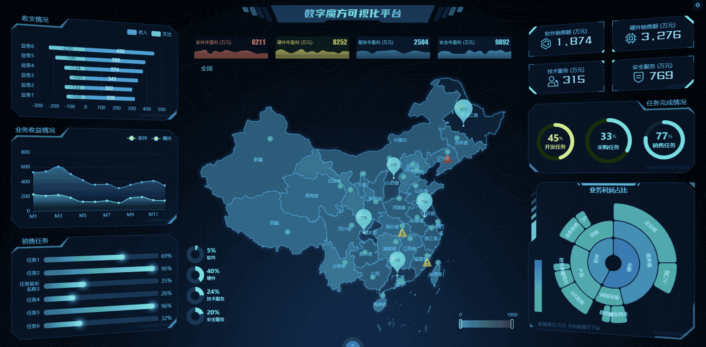
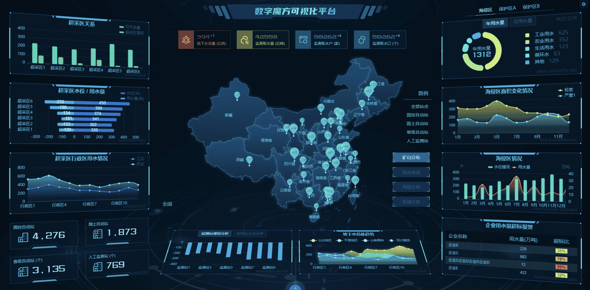
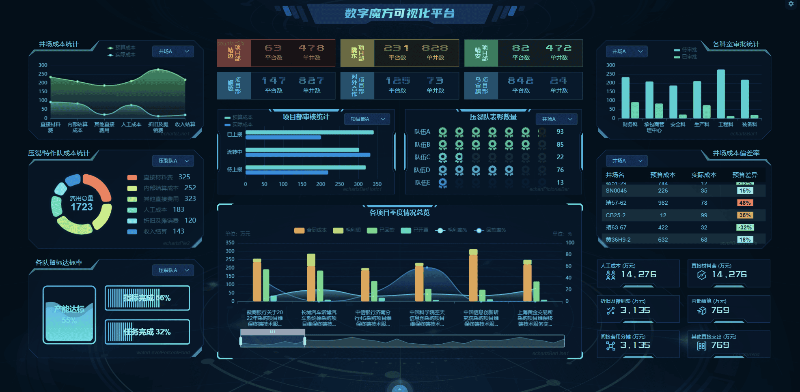
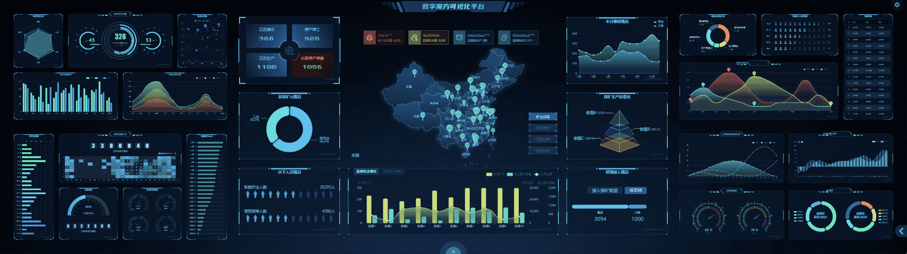
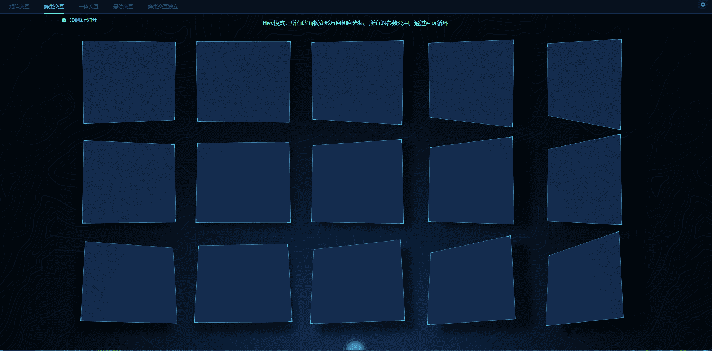
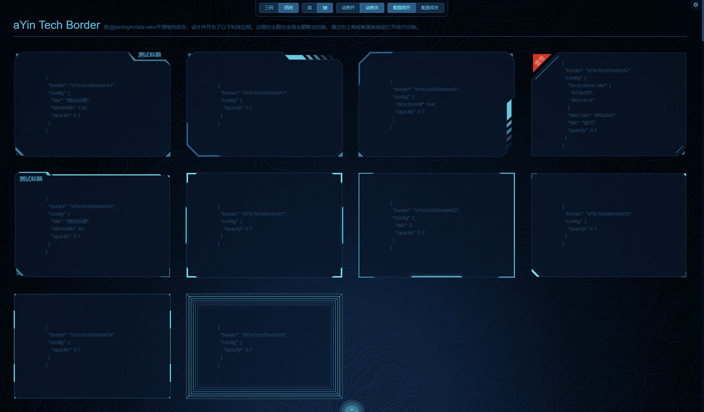
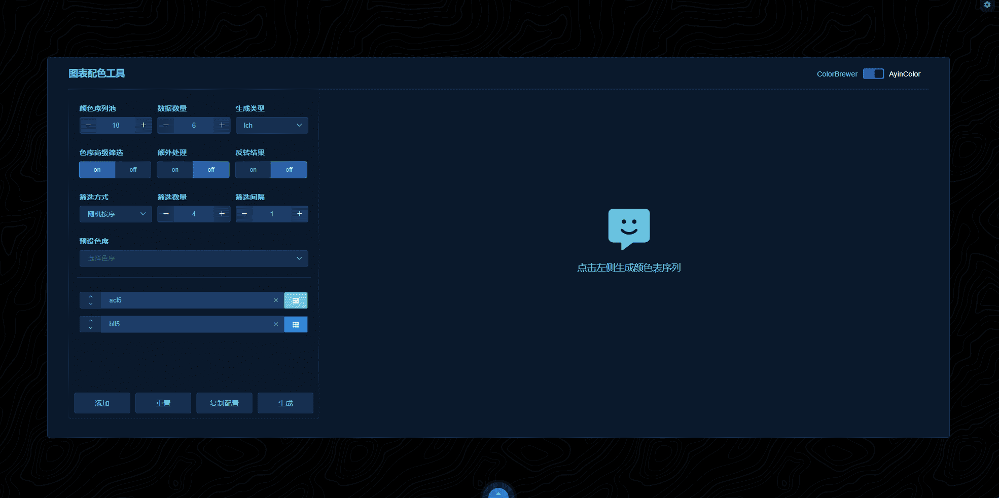
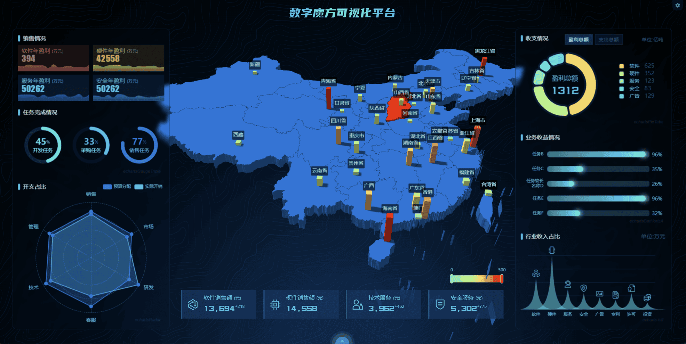

[简体中文](./README.cn.md) | 繁體中文 | [English](./README.md)

<h1>
<b>本開發包廢棄請查看新發布的開發包techUI，其中techUI-lite是一個免費版本，自由使用無限制。 </b>

Lite version

Demo 點擊這裡查看 https://lite.techui.net

Docs 點擊這裡查看 https://lite.techui.net/docs

Premium version

Demo 點擊這裡查看 https://techui.net

Docs 點擊這裡查看 https://techui.net/docs
</h1>

<h1 align="center">
<b>數字魔方 開發包</b>
</h1>

Digitcube數字魔方是壹款簡單易用的可視化大屏前端框架，基於vue2開發

  <a href="https://doc.ayin86.com/">文檔</a> •
  <a href="https://ayin86.com/">演示站</a> •
  <a href="https://www.npmjs.com/package/digitcube-core">核心庫</a> •
  <a href="https://space.bilibili.com/302402751">Bili</a> •
  <a href="https://t.me/ayin86cn">Telgram</a>

## 🛡️聲明

**2023年3月16日，開發包的核心文件升級至了1.4的，有部分破壞性更新，請重新下載開發包。**

**此前的版本開發包如果核心庫和語言包還保留原始版本，可正常使用。如果此前的開發包升級至最新的1.4核心，則無法正常工作。**

**本開發包內置的臨時許可證，僅用於測試、體驗、學習。無法調試，無法打包部署。** 

本開發包內的文件為開發源碼，僅需更新許可證即可用於商業項目開發，詳情請聯系管理員。

- 免費用戶，可以通過本開發包學習數據可視化的開發思路、設計、主題、多語言、樣式、布局、以及echarts的使用等
- 授權用戶，聯系管理員更新許可證後直接進入開發階段。

**本開發包內置5個數據屏，如下圖。**

**數據屏A**-支持地圖下鉆數據聯動

**數據屏C**

**數據屏D**

**數據屏A-移動端** 

**企業拼接屏4x2**

**本開發包內置3個功能界面，分別是3D面板、科技邊框、圖表配色工具**

**3D面板**

**科技邊框**

**圖表配色工具**

**更多demo，請查閱 [數字魔方演示站](https://ayin86.com/)** 

-----

## ✨特性

- **🖥️全端適配**

  完美的全端適配方案，個人電腦、手機、平板、企業拼接屏，可以說任何終端設備均可以完美適配，行業內領先的適配方案。

- **🎨強大的內置主題**

  壹鍵切換風格，所有元素，事無巨細的元素和細節均完美支持主題切換。主題可以根據客戶需求使用內置主題設計器進行快速的定制化開發。

- **🛸自由開發無限制**

  采用webpack、vue2等流行技術棧，通過調用自研發組件和圖表組件，不需要過多繁瑣的開發過程即可快速部署上線，大大縮短了開發周期。真正做到了源碼級的自由開發。

- **🧩去位圖化全面使用SVG**

  全面矢量化（去位圖化），因可視化大屏的特殊使用場景，采用傳統位圖的情況圖形放大細節模糊，而采用矢量圖細節縮放後還能保持原來的細節清晰度。

- **📊企業拼接屏**

  面對企業級的拼接屏，我們有著非常多的展現方案，可以根據客戶的拼接屏設備情況進行定制開發。在任意設備下均可以達到最佳的展現效果。

- **🌈圖表智能配色**

  使用本框架，就徹底告別了圖表配色這壹頭疼的問題。提供了智能圖表配色的功能和圖表配色工具。

- **🗺️GEO 3D 地圖**

  基於GEO Json格式的地圖，簡單易上手，能滿足絕大多數的使用場景，可以在地圖上放置點、線、面、圖形等任意數據。可以用平面或者3D的形式展現地圖。

- **🧑‍國際化**

  面向全球業務，擴大市場覆蓋範圍，國際化可以提高用戶滿意度、降低開發和維護成本、增加軟件的可擴展性。

- **🚀穩步叠代急速響應**

  本框架歷經兩個大版本，無數小版本的叠代，bug修復及時，功能拓展穩步進行中。對於付費用戶可以做到及時響應。

-----

## 📜更新說明

- **20230316 核心升級至1.4 新增了系統標題組件，以及大量細節修改。**

- **20230302 移動端數據屏，拼接屏的開發源碼，集成到開發包中。**
- **20230225 文檔更新英文和繁體中文語言**
- **20230223 首次發布開發包到Gitee和Github，文檔同步發布**

可能會發布壹個免費版，不含主題、多語言這些功能，組件也會少壹些。供免費商用，提供的組件列表如下（初定）:

- 自適應組件（僅等比模式）
- 圖表組件
- 科技面板（大概10-12個）
- 科技標題
- 塊標題
- loading
- SVG背景

這些組件，基本上能滿足壹個普通的商業項目的需求，至於其他功能，則僅在高級版裏面提供。免費版可以自己添加任何三方組件或者自定義組件來實現其他功能。

時間節點不確定，畢竟作者完全是業余時間來開發，大致可能在3-6個月後發布，敬請期待。

-----

## 📖安裝教程

1.  `cnpm i` 安裝依賴，建議使用cnpm
2.  `npm run serve` 啟動項目即可預覽

開發包介紹和使用方式請查閱 [文檔](https://doc.ayin86.com/)

-----

## 🌟許可證授權

如果您需要購買授權或者合作洽談，請添加 [Telgram@ayin86cn](https://t.me/ayin86cn) 詳聊。

也可以添加數字魔方的討論群組 [DigitcubeGroup](https://t.me/+RJZ4cmDrcCFmNWNl)

也可以通過郵件聯繫  ayin86cn@gmail.com
