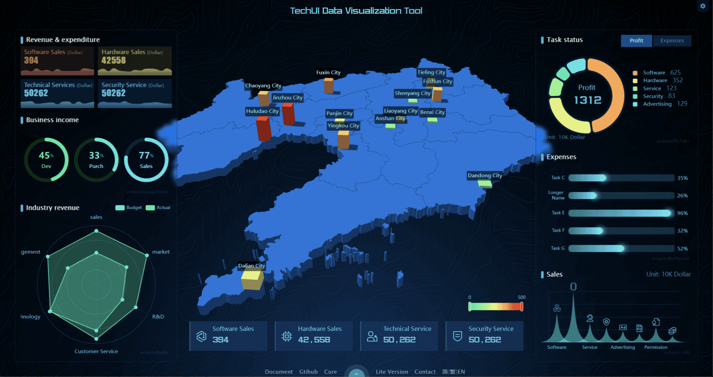
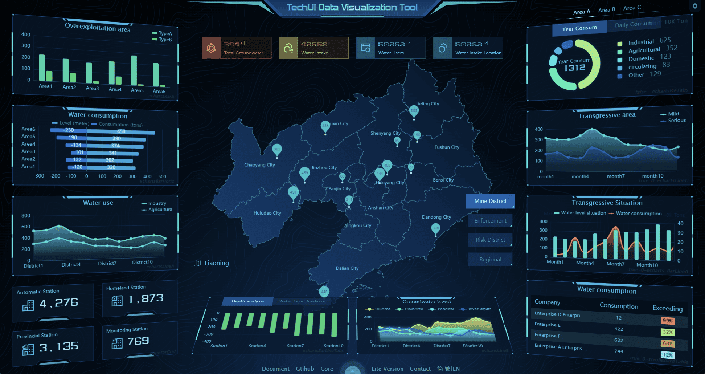
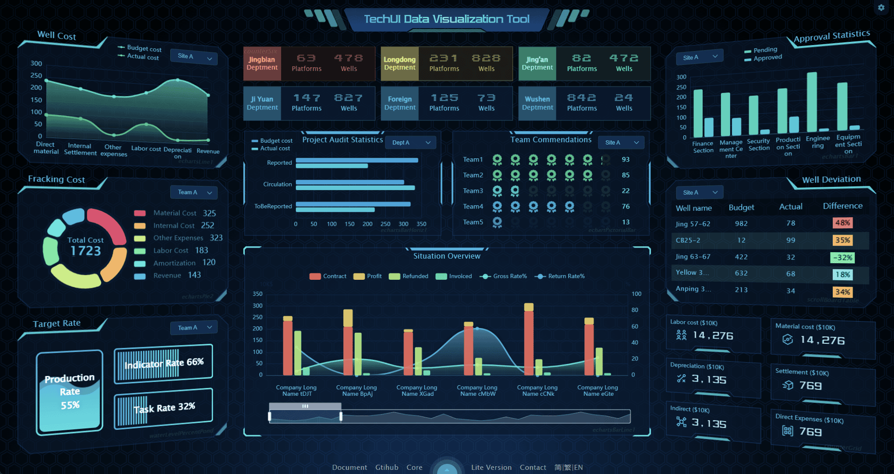
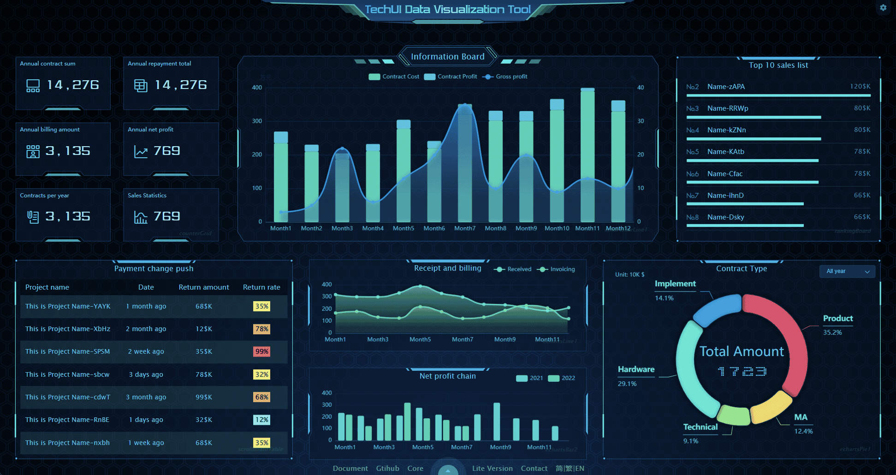
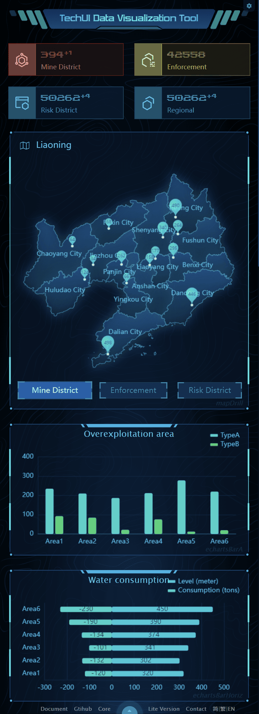
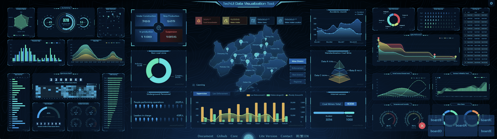
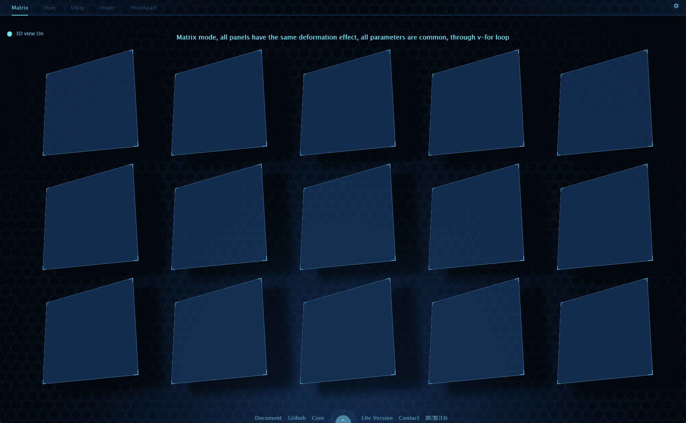
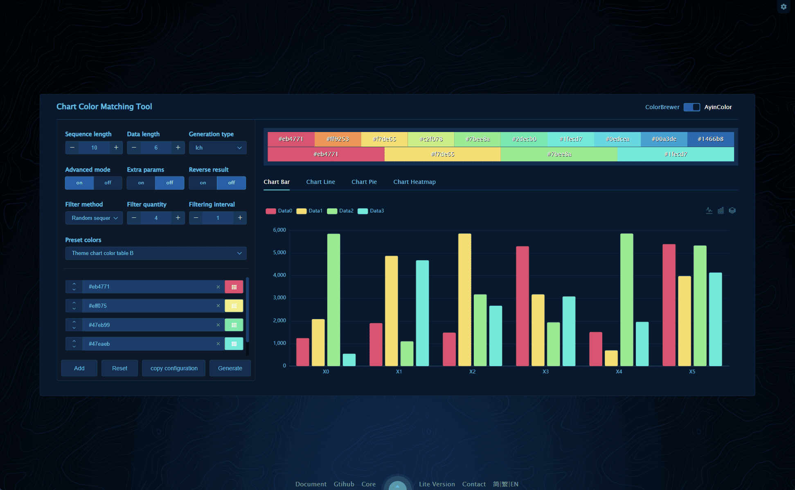
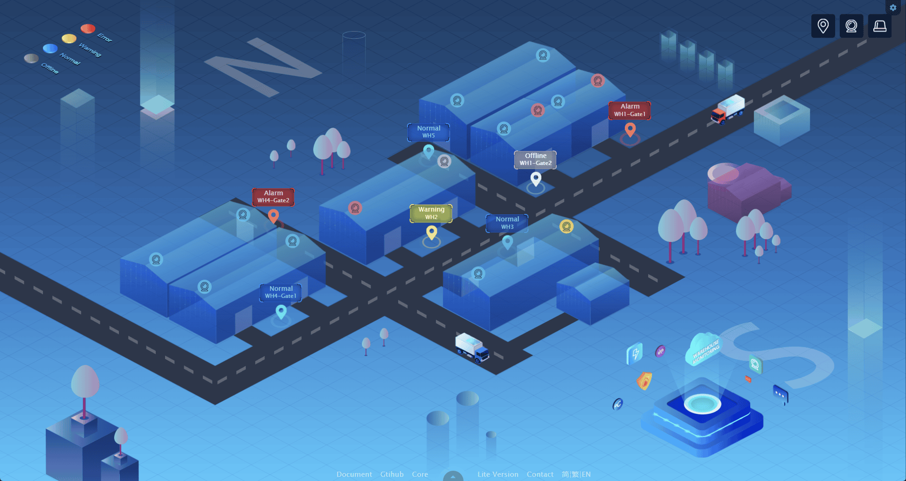
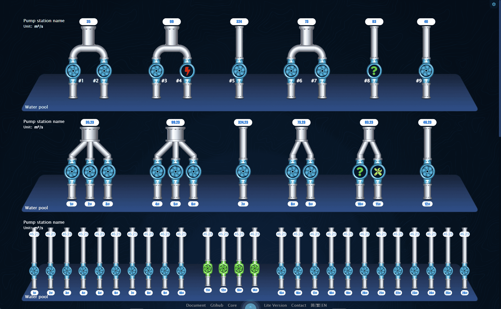

[简体中文](./README.cn.md) | [繁體中文](./README.hk.md) | English

**This page was translated by Google**

<h1 align="center">
<b>TechUI Development Kit</b>
</h1>

TechUI is a free and easy to use Dynamic SVG Data Visualization Dashboard development tool, based on vite + vue2 development

   <a href="https://lite.techui.net/docs">Documentation</a> •
   <a href="https://lite.techui.net/">Demo Site</a> •
   <a href="https://www.npmjs.com/package/techui-vue2">Core library</a> •
   <a href="https://lite.techui.net/docs">Lite（Free Version）</a> •
   <a href="https://t.me/ayin86cn">Telgram</a>

## 🛡️ Declaration

**The temporary license built into this development kit is only used for testing, experience and learning. Unable to debug, unable to package and deploy.** 

**In addition, a free [techUI-lite](https://lite.techui.net/docs/) framework is provided, welcome to download and use**

The files in this development kit are source codes, which can be used for commercial project development only by updating the license. For details, please contact the administrator.
- For authorized users of the advanced version, contact the administrator to update the license and enter the development stage directly.
- Please find my contact information at the bottom of this document.

-----

There are currently 4 built-in versions of the development kit
- package-i18n multilingual development package, built in 3 languages, Simplified Chinese, Traditional Chinese, English
- package-english Single language development package-English
- package-simple-chinese Single language development package - Simplified Chinese
- package-traditional-chinese Single language development package - Traditional Chinese

Please download according to specific needs. The i18n version is slightly complicated because it calls the language definition. Try to choose a single-language development kit for testing and development.

-----

**This development kit has several built-in Dashboards, as shown in the figure below.**

**DashboardA**

**DashboardB**

**DashboardC**

**DashboardD**

**DashboardE**

**DashboardA-Mobile terminal**

**Enterprise splicing screen 4x2**

**3D panels**

**Chart color matching tool**

**For more demos, please refer to [techUI Demo](https://techui.net/)**

-----

## ✨Features

- **🖥️ Full End Adaptation**

  Perfect all-end adaptation program, personal computer, cell phone, tablet, enterprise splicing screen, it can be said that any terminal device can be perfectly adapted, the industry's leading adaptation program.

- **🎨 Powerful built-in theme**

  One-click switching style, all elements, elements and details of everything are perfectly supported theme switching. Themes can be developed quickly and customizable according to customer needs using the built-in theme designer.

- **🛸Free development without limitations**

  Using webpack, vue2 and other popular technology stack, by calling self-developed components and chart components, you can quickly deploy online without too much tedious development process, greatly reducing the development cycle. Truly source-level free development.

- **🧩De-bitmap full use of SVG**

  Full vectorization (de-bitmap), because the visualization of the special use of large screen scenarios, the use of traditional bitmap situation graphics zoom details blurred, while the use of vector graphics details scaled can also maintain the original details of clarity.

- **📊 enterprise splicing screen**

  In the face of enterprise splicing screen, we have a very large number of display solutions, can be customized according to the customer's splicing screen equipment situation development. Under any equipment can achieve the best display effect.

- **🌈 Smart color matching for charts**

  Using this framework, you can completely say goodbye to the chart color matching headache. Provides intelligent chart color matching features and chart color matching tools.

- **🗺️GEO 3D Map**

  Based on GEO Json format map , easy to use , can meet most of the use of scenarios , you can place points , lines , surfaces , graphics and other arbitrary data on the map . The map can be presented in flat or 3D form.

- **🧑‍ Internationalization**

  Aiming at global business and expanding market coverage, internationalization can improve user satisfaction, reduce development and maintenance costs, and increase the scalability of the software.

- **🚀Steady iteration of rapid response**

  The framework has gone through three major versions and numerous minor iterations, with timely bug fixes and steady feature expansion. For paying users can do a timely response.

-----

## 📜 Update Description

- **20230707 release framework techui-vue2, techui-vue3-lite, demo, documentation, development kit, among which vue2 development includes multi-language and single-language versions.**
- **20230701 The core is upgraded to 3.1, and the wasm module has been used since 3.0 for license logic, encryption and decryption logic, and SVG dynamic node calculation**
- **202304-202306 core version 2.0-2.2, extensively modify component names, calling methods, and built-in methods to make the whole framework more standardized and easy to use.**
- **20230316 The core is upgraded to 1.4, and a system title component is added, as well as a lot of detailed modifications.**
- **20230302 Mobile terminal Dashboard, the development source code of splicing screen, integrated into the development kit.**
- **20230225 Documentation update English and Traditional Chinese language**
- **20230223 Release the development kit to Gitee and Github for the first time, and the documents are released simultaneously**

-----

## 📖Installation Tutorial

1. `cnpm i` installs dependencies, it is recommended to use cnpm
2. `npm run dev` starts the project and you can preview it

For the introduction and usage of the development kit, please refer to [Documentation](https://techui.net/docs)

-----

## 🛠️ Compatibility and Nodejs version

1. nodejs 16-18 is well supported, other versions have not been tested
2. All mainstream browsers except IE are well supported, including mobile browsers.

-----

## 🌟 Cooperation negotiation

The Lite version framework is free to use and does not provide any technical support. If you encounter any problems, please submit issues on github。

Or add [TechUI discord](https://discord.gg/JXgn5Gq2) to the discussion group.

Or add [TechUI Telgram](https://t.me/+RJZ4cmDrcCFmNWNl) to the discussion group.

For paid services, such as custom development, technical support, or purchasing a premium license, please contact me via the following contact information

WhatsApp scan the QR code below.

Or contact me via Telegram [@ayin86cn](https://t.me/ayin86cn)

You can also contact me via email ayin86cn@gmail.com I will check my email every 1-3 days

-----

## ❤️ What I can offer

The author himself, a UI designer turned front-end developer, has been in the field for 15 years and can take on the responsibilities of product manager, UI designer and front-end developer in a project or product development.

Therefore, it can be said to be the best and cost-effective partner for a start-up company, welcome to discuss cooperation. I hope to find a stable and long-term remote job. Preferably a remote job in Canada, hope to have the opportunity to go to this country.

#### Specific tasks that can be done

- UI design
- Planning and design of products and projects
- Visualization project development
- GEO project development (echarts+geojson+online map)
- Rust development of WASM modules
- Any type of business system
- APP development
- Documentation compilation
- Front-end security, encryption and decryption